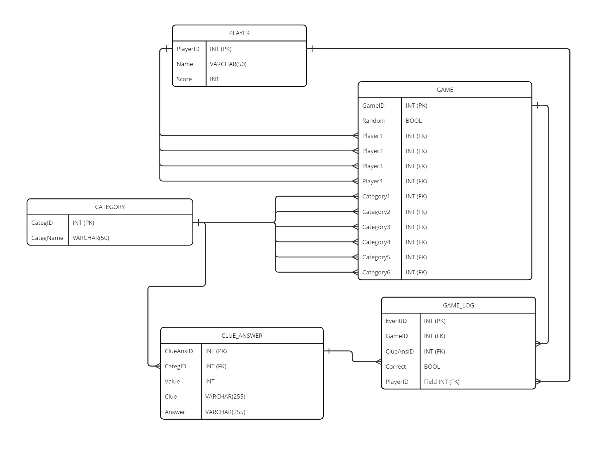

# Project Milestone 5: SQL Design
The preliminary tables below will comprise the SQL structure to maintain and facilitate JeoparDIY gampeplay.

***
## Entity Relationship Diagram

***
## Category Table
### Table Name: 
Category

### Description: 
Stores information related to our custom categories, which currently include Geography, History, Literature, Pop Culture, Science, and Sports. This table links each category to its corresponding questions and answers.

### Fields:
- CategID INT PRIMARY KEY  
	Unique numerical identifier (primary key) for each game category.  
- CategName VARCHAR(50)  
	Name for each category, e.g., Geography, History, Literature, etc.  

### Constraints:
- CategID must be unique and not null (primary key)
- CategName must be unique and not null

### Relationships:
- Links to the Clue_Answer Table's foreign key through category_id.
- Links to the Game Table's foreign key through category_id.

### Example Functions/Queries:
Functions to generate random versus selected categories:  
	generate_categ_rand: returns 5 random categories from the database  
		example query: SELECT  CategName FROM category ORDER BY RANDOM() LIMIT 5    
	
	generate_categ_select: requires categories selected by user as a parameter; returns 5  preselected categories from the database   
		example query: SELECT category_name FROM category WHERE category_id IN ({})  

### Tests:
Use case name:
- Fetch 5 clue/answers that belong to CategName when CategID is queried

Description:
- Test game generation/customization

Pre-Conditions:
- Game initiation has been started w/ "Lets Play" onClick behavior, player names *may or may not* be established at this point.

Test Steps:
1) Navigate to 'Create Game' page
2) Enter quantity of players and their names
3) Test Random Category selection; click 'Random', start game
4) Test Custom Category selection; click 'Custom', start game

Expected Results:
- Valid game board is generated with 6 categories w/ 5 clue/answer squares each

Actual Results:
- Assert 6 category values are returned, each with a data length of 5 clue/answers

Status:

Notes:

Post-Conditions:
- Game is established and ready to play.

***
## Clue_Answer Table
#### Table Name:
Clue_Answer

### Description:
Contains all questions and clues pulled from past Jeopardy games, associated with categories.

### Fields:
- CluesAnsID INT PRIMARY KEY  
	Unique numerical identifier (primary key) for each clue and associated answer pair.  
- CategID INT (Foreign Key References Category(CategID))  
	The corresponding category id for each clue, from the Category table.  
- Value INT(5,2)  
	The prize ($) value for each clue to be awarded if the answer is correct.  
- Clue VARCHAR(255)  
	Text containing the clue, in the form of a statement.   
- Answer VARCHAR(255)  
	Text containing the answer, in the form of a question.  

### Constraints:
- CluesAnsID must be unique and not null (primary key)  
- CategID must exist as primary key in the Category table  
- Value field is greater than 0 and all fields cannot be null  

### Relationships:
Each ClueAnsID correlates to a specific category (CategID in Category table).

### Example Functions/Queries: 
Function to retrieve clues/answer based on user selection, which is a parameter:  
	get clue(CluesAnsID): uses query SELECT CluesAnsID, Clue, Answer FROM Clue_Answer     
									WHERE CluesAnsID = <user_selected CluesAnsID>  

### Tests:
Use case name:  
- Verify correct clues and answers are generated based on player's selection.   

Description:  
- Test the selection of a dollar amount in a clue category and the result that's generated.     

Pre-Conditions:  
- Player names and categories with clues were generated. A player is set as the active player.  

Test Steps:  
1) Click on a clue (dollar value) square within a category.  
2) Enter an answer after the clue is displayed.  

Expected Results:  
1) A clue that is relevant to its category is displayed after the square is selected.  
2) The correct answer is displayed after the player enters a response.  
 
Actual Results:  
tbd  

Status:  

Notes:  

Post-Conditions:  
- Player's response and correct answer can be compared to determine score.  

***
## Player Table
### Table Name: 
Player

### Description: 
Contains the current players and their attributed data.

### Fields:
- PlayerID INT PRIMARY KEY  
	Unique numerical identifier (primary key) assigned to current players.  
- Name VARCHAR(50)  
	Name entered by each player to be displayed along with scores during game session.  
- Score INT  
	Points scored (money earned) per player in the current game and updated as clues are answered correctly.  

### Constraints:
- PlayerID is unique and not null (primary key)  
- Name is not null and must be unique for relevant game id (two players under the same game id cannot use the same name).  
- Score is greater than or equal to 0  

### Relationships:
- Player# in Game table references the PlayerID in Player table  
- Score is queried  

### Example Functions/Queries:  
Function to update a player's score after entering a correct answer and pulling the score value.  
update_player_score(PlayerID, Value)  
	example query: UPDATE Player SET Score = Score + ? WHERE PlayerID = ?  
	
### Tests:  
Use case name:  
- Verify that player names and scores are accurately displayed and updated. 

Description:  
- Test that the correct player's score is increased or decreased by the indicated question value after the player answers the question correctly/incorrectly.
Pre-Conditions:  
-  Player names and categories with clues were generated. A player is set as the active player.

Test Steps:  
1) Click on a clue (dollar value) square within a category.  
2) Enter a response to the clue.

Expected Results:  
1) If the resposne was correct, the player's score is increased by the dollar value associated with the question while the other players' scores remain unchanged.
2) If the response was incorrect, the player's score is decreased by the dollar value associated with the question while the other player's scores remain unchanged.
 
Actual Results:  
tbd

Status:  

Notes:  

Post-Conditions:  
- All players' scores are correctly updated and displayed, and the active player can select the next clue. 

***
## Game Table
### Table Name: 
Game

### Description:
Table for tracking/storing current game and board data.  

### Fields:
- GameID INT PRIMARY KEY  
	Unique numerical identifier (primary key) assigned for game in progress.  
- Random BIT (possibly exlude)  
	'1' if players choose to have random categories generated for the game; '0' if players elect to choose the categories for the game  
- Player1 INT (Foreign Key References Player(PlayerID))  
	Unique id for player #1 in current game session, from Player table  
- Player2 INT (Foreign Key References Player(PlayerID))  
	Unique id for player #2 in current game session, from Player table  
- Player3 INT (Foreign Key References Player(PlayerID))  
	Unique id for player #3 in current game session, from Player table  
- Player4 INT (Foreign Key References Player(PlayerID))  
	Unique id for player #4 in current game session, from Player table  
- Category1 INT (Foreign Key References Category(CategID))  
	Unique id for Category1 in current game session, from Category table  
- Category2 INT (Foreign Key References Category(CategID))  
	Unique id for Category2 in current game session, from Category table  
- Category3 INT (Foreign Key References Category(CategID))  
	Unique id for Category3 in current game session, from Category table  
- Category4 INT (Foreign Key References Category(CategID))  
	Unique id for Category4 in current game session, from Category table  
- Category5 INT (Foreign Key References Category(CategID))  
	Unique id for Category5 in current game session, from Category table  
- Category6 INT (Foreign Key References Category(CategID))  
	Unique id for Category6 in current game session, from Category table  

*Note: Player2, Player3, and Player4 fields can be null  

### Constraints:  
- GameID must be unique and not null (primary key)  
- Player id and Category id exist as primary keys in Player and Category tables, respectively.  
### Relationships:  
- Player# references PlayerID in Player table and Category# references CategID from Category table. 
### Tests:
Use case name:  
- Verify Game Setup and Player Assignments 

Description:  
- This test verifies that a new game setup correctly assigns players and categories based on player selections or random generation..

Pre-Conditions:  
- The "Create Game" page is accessible.
- Player names (1 to 4) are available for input.
- Categories are either chosen by players or set to be randomly selected.  
  
Test Steps:  
1) Navigate to the "Create Game" page.
2) Enter player names and select categories.
3) Select the option for random or custom category selection.
4) Submit to create a new game session.

Expected Results:  
1) A new GameID is generated.
2) PlayerIDs are correctly assigned to Player1, Player2, ... fields based on input.
3) Categories are assigned to Category1, Category2, ... fields either based on player selection or randomly.
4) If the "Random" option was selected, categories assigned should be unique and randomly chosen from the Category table.
 
Actual Results:  
tbd

Status:  

Notes:  

Post-Conditions:  
- A new game session is created and ready to start with players and categories assigned.

***
## Game_Log Table
### Table Name:
Game_Log

### Description:
Logs the current state of gameplay to retrieve in case of page refresh/navigation

### Fields:
- EventId INT PRIMARY KEY  
	Unique identifer for the event of selecting a clue producing a result (win or lose) for a game session. 
- GameID INT (Foreign Key References Game(GameID))  
	The game id that's being logged with the clue/answer ids and results bit. 
- CluesAnsID INT (Foreign Key References Clue_Answer(ClueAnsID))  
	Unique identifer for the clue/answer, from the Clue_Answer table.  
- Correct BIT  
	'1' if answer for the clue is correct; '0' is answer is incorrect  

### Constraints:
- EventId must be unique and not null (primary key)  
- GameID and CluesAnsID must exist as primary keys in Game and Clue_Answer tables, respectively  
- Correct field cannot be null  

### Relationships:
- GameID references GameID in the Game table and Game_Log produces specific game data  
- CluesAnsID references CluesAnsID in the Clue_Answer table.  
  
### Tests:
Use case name:  
- Track Correct and Incorrect Answers for a Single Game Session

Description:  
- This test ensures that the Game_Log table accurately logs each event of answering a clue, recording whether the response was correct or incorrect.

Pre-Conditions:  
- A game session is active with GameID.
- Players are interacting with the game, selecting clues and submitting answers.
  
Test Steps:  
1) Player selects a clue from the game interface.
2) Player submits an answer to the selected clue.
3) System evaluates the answer and records the result in the Game_Log.

Expected Results:  
1) For each submitted answer, a new EventId is generated in the Game_Log.
2) The GameID field matches the current game session.
3) The CluesAnsID field correctly identifies the clue answered.
4) The Correct field accurately reflects whether the player's answer was correct (1) or incorrect (0).
 
Actual Results:  
tbd

Status:  

Notes: 
- This test should be repeated for multiple clues and answers, both correct and incorrect. 

Post-Conditions:  
- The Game_Log contains accurate logs of all attempts to answer clues, allowing for game progress tracking and potential recreation.
