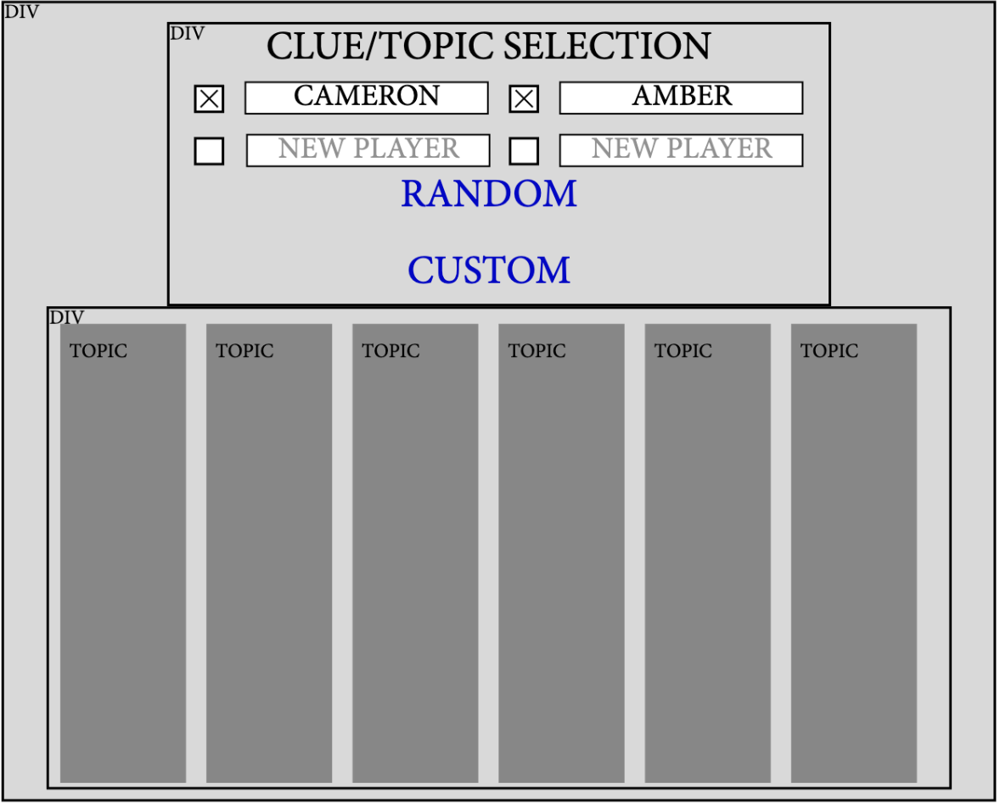

# Project Milestone 4: Page Testing
## Page 1: Welcome

Page 1 Title: Welcome to JeoparDIY!

Prototype: 

Parameters: None

Data Needed: None

Link Destinations: 

1) <u>How-To</u>: for game instructions, available configurations, and player objectives.	
2) <u>Let's Play!</u>: link for starting a game

Tests for verifying the rendering of the page:

1) Visiting root level of website returns HTML for rendering welcome page
2) Ensure that **How-To** link navigates to corresponding page and URL
3) Ensure that **Let's Play** link navigates to corresponding page and URL
***

## Page 2: How-To

Page 2 Title: How-To

Prototype: 

Parameters: None

Data Needed: None

Link Destinations: 

1) <u>Home</u>: Return to Homepage	
2) <u>Let's Play!</u>: link for starting a game

Tests for verifying the rendering of the page:

1) Visiting **/How-To** (or similar) URL of website returns HTML for rendering how-to page
***

## Page 3: Create Game

Page 3 Title: Create Your Game

Prototype: 

Parameters:  

1) Number of players, collected via radio button (or similar)
2) Names of players, collected via user input
3) If **CUSTOM**, categories (6) (updates page based on user selections of categories such as Geography, History, Literature, Pop Culture, Sports)
4) If **RANDOM**, categories (6) at random...see Data Needed)

Data Needed: 

1) Categories, either custom selected from list OR randomly selected from database
    - Will need selected categories; their respective clues AND clues will be gathered upon starting game
    - If **CUSTOM**, fetch list of all categories and render as the dropdown list, series of radio buttons, etc.

Link Destinations: 
1) <u>Home</u>: Return to Homepage (not shown in prototype)

Tests for verifying the rendering of the page:
1) Verify that 1, 2, 3 and 4 player games initiate correctly
2) Verify that **RANDOM** reliably generates a full six category game onClick() (repeat selections with each click)
    - onClick() of submit/play button initiate gameplay and navigate to **/gameplay**
4) Verify that **CUSTOM** reliably generates a full six category game on
    - onClick() of submit/play button initiate gameplay and navigate to **/gameplay**
5) Visiting **/CreateGame** (or similar) URL of website returns HTML for rendering create game page
***

## Page 4: Game

Page 5 Title: Hint

Prototype: 

Parameters: 
1) Active player
    - Populate user input box with active player's name and prompt
2) Clue Name/ID
3) Clue Value
4) User response
    - Gather from user input

Data Needed:
1) Correct Question (answer)
2) Clue text/description

Link Destinations: 

1. <u>Home</u>: Return to Homepage
2. <u>Submit</u>: Navigate to Answer page

Tests for verifying the rendering of the page:
1) Verify that answer text/card and its value rendered matches the button clicked previously
2) Verify that incorrect user input triggers incorrect response (navigate/trigger answer)
3) Verify that correct user input triggers correct response (navigate/trigger answer)
4) Verify that empty user input triggers error message prompting valid input
5) Verify that **/Game{id}/Hint** URL renders page correctly
    - If visited prior to game creation, error message and redirect occurs
***

## Page 5: Hint

Page 5 Title: Hint

Prototype: 

Parameters: 
1) Active player
    - Populate user input box with active player's name and prompt
2) Clue Name/ID
3) Clue Value
4) User response
    - Gather from user input

Data Needed:
1) Correct Question (answer)
2) Clue text/description

Link Destinations: 

1. <u>Home</u>: Return to Homepage
2. <u>Submit</u>: Navigate to Answer page

Tests for verifying the rendering of the page:
1) Verify that answer text/card and its value rendered matches the button clicked previously
2) Verify that incorrect user input triggers incorrect response (navigate/trigger answer)
3) Verify that correct user input triggers correct response (navigate/trigger answer)
4) Verify that empty user input triggers error message prompting valid input
5) Verify that **/Game{id}/Hint** URL renders page correctly
    - If visited prior to game creation, error message and redirect occurs
***

## Page 6: Answer

Page 6 Title: Answer

Prototype: 

Parameters:
1) Active player (depending on UI/UX this likely is not needed)
2) Clue Name/ID
3) Clue Value
4) User Input from Hint Page

Data Needed: 
1) Correct Question (answer)

Link Destinations: 

1) <u>Home</u>: Return to Homepage
2) <u>Return</u>: Return to Gameplay page

Tests for verifying the rendering of the page:
1) Verify that answer text/card and its value rendered matches previous hint card
2) Verify that incorrect user input triggers visual response (indicate by color or similar)
3) Verify that correct user input triggers visual response (indicate by color or similar)
4) Verify that onClick() of return button, return to game and increment/decrement is registered
5) Verify that **/Game(id)/Hint** URL renders page correctly
    - If visited prior to game creation, error message and redirect occurs
***

## Page 7 Game Over

Page 7 Title: Game Over!

Prototype: 

Parameters: 
1) Number and names of players from gameplay
2) Current point values of each player
3) *Push same or new decision to /CreateGame for correct rendering*

Data Needed: No new data is needed from DB

Link Destinations: 

1) <u>Same Players</u>: Return to page 3 (Create Your Game) with same player names filled in.
2) <u>New Players</u>: Return to page 3 (Create Your Game) and fill in player names.
3) <u>Home</u>: Return to Homepage (quit)

Tests for verifying the rendering of the page:
1) Verify that player currently in lead is declared winner
    - Verify that remaining players are declared in descending order of their respective final point values
2) Verify that each of the above links trigger navigation to their respective destinations
3) Verify that upon tie, all tied players are declared as winners (double check this is even possible)
