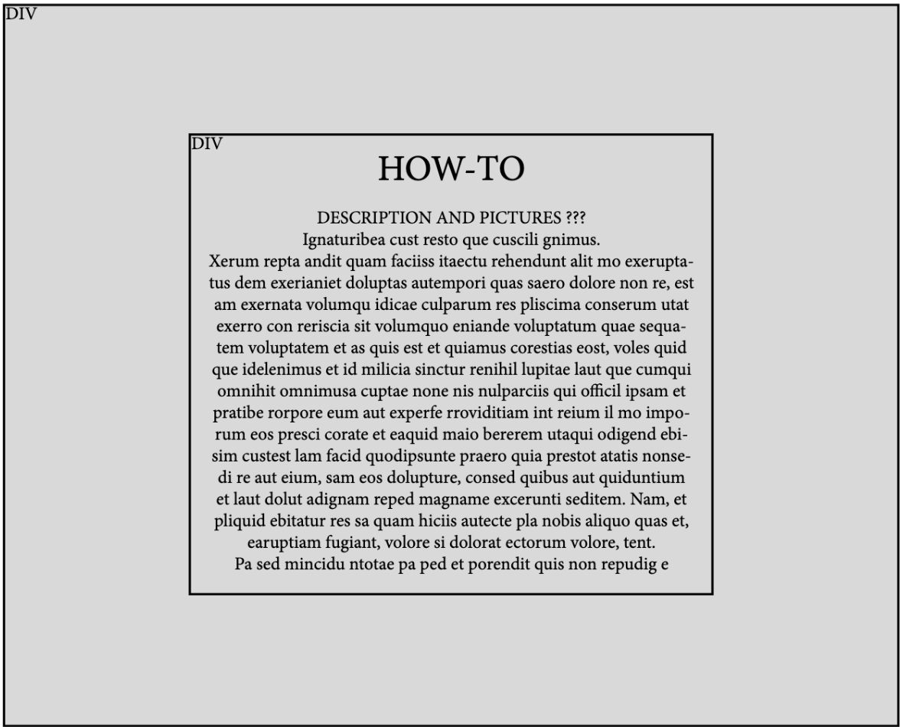

JeoparDIY Web Page Design

  

Page 2 Title: How-To

Prototype: 

Parameters: None

Data Needed: 

Link Destinations: 

1. <u>Home</u>: Return to Homepage
	
2. <u>Let's Play!</u>: link for starting a game

Tests for verifying the rendering of the page:

