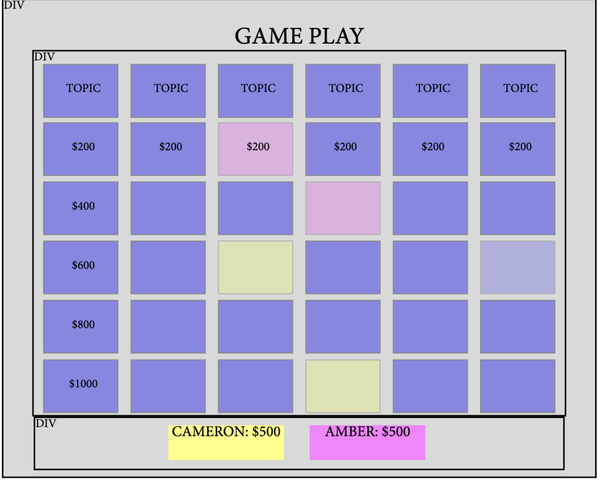

JeoparDIY Web Page Design

  

Page 4 Title: Game Play

Prototype: 

Parameters:
1) Number and names of players from **/CreateGame**
2) Category selections from **/CreateGame**
    - Categories (name and order)

Data Needed: 
1) Categories data, either custom selected from list OR randomly selected from database
    - Will need selected categories; their respective clues AND the clues corresponding point values

Link Destinations: 

1) <u>Reset</u>: return to page 3 (Create Your Game) to reset game
2) <u>Home</u>: Return to Homepage

Tests for verifying the rendering of the page:
1) Verify that 1, 2, 3 and 4 player games initiate correctly
    - Names of players and categories are passed successfully and order is maintained
3) Verify that 1, 2, 3 and 4 player games maintain order correctly
4) Verify that 1, 2, 3 and 4 player games maintain score correctly
5) Verify that clicking on a clue box navigates to a window corresponding to that clue
6) Verify that correct answer increments corresponding player's score with the correct value
7) Verify that incorrect answer decrements corresponding player's score with the correct value
8) Verify that "spent" clues are colored uniquely and do not allow onClick() behavior
9) Verify that when all clues have been revealed, either:
    - Game completes and navigates to GameOver page
    - Game enters double and final jeopardy rounds respectively
10) Verify that **/Game{id}** URL renders page correctly
    - If visited prior to game creation, error message and redirect occurs

