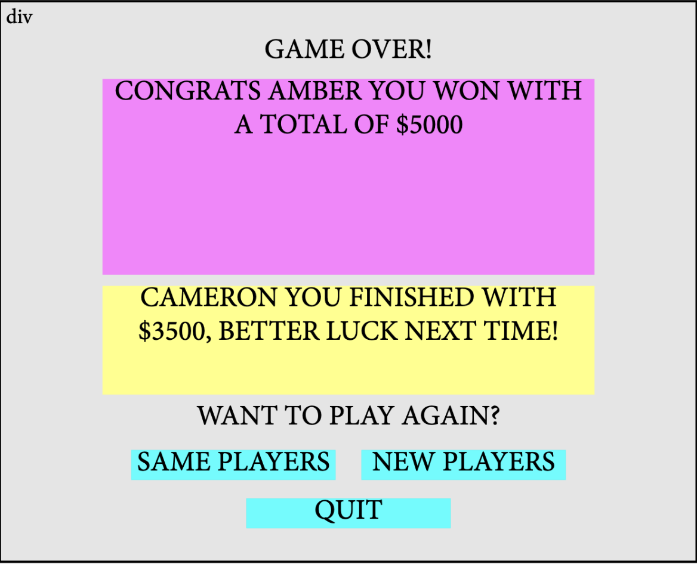

JeoparDIY Web Page Design

  

Page 7 Title: Game Over!

Prototype: 

Parameters: 
1) Number and names of players from gameplay
2) Current point values of each player
3) *Push same or new decision to /CreateGame for correct rendering*

Data Needed: No new data is needed from DB

Link Destinations: 

1) <u>Same Players</u>: Return to page 3 (Create Your Game) with same player names filled in.
2) <u>New Players</u>: Return to page 3 (Create Your Game) and fill in player names.
3) <u>Home</u>: Return to Homepage (quit)

Tests for verifying the rendering of the page:
1) Verify that player currently in lead is declared winner
    - Verify that remaining players are declared in descending order of their respective final point values
2) Verify that each of the above links trigger navigation to their respective destinations
3) Verify that upon tie, all tied players are declared as winners (double check this is even possible)

